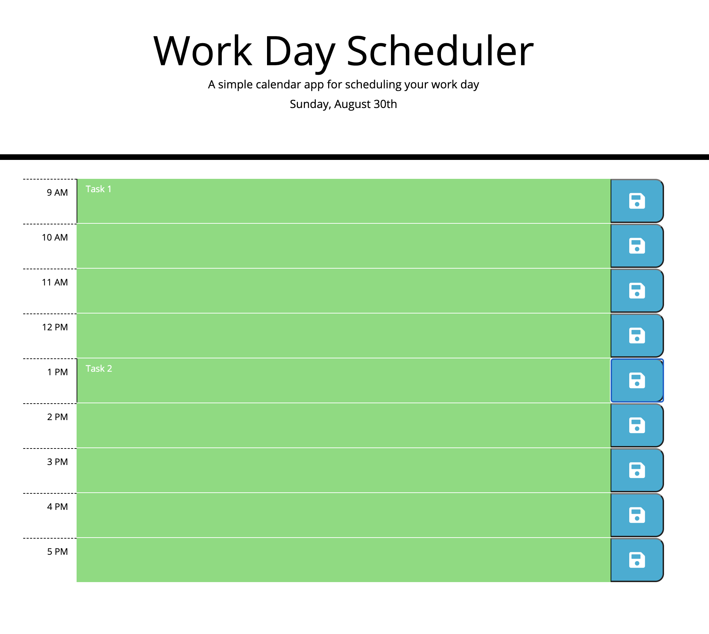

# Work Day Scheduler Starter Code

## Function
This app was built to help schedule out a busy day. This app loads with hour time slots between the 9AM - 5PM. The user is presented with the given day in the header. The user can enter a task into the field and then save each tasks. Tasks are then saved to the local storage so tasks persist on page reload. This app uses moment.js to manage time and display colors depending on if times are past, present, or in the future.

## Instructions
* open up page
* click on the field for the hour you wish to add a task
* Type in the task you wish and click the save button next to the field
* Feel free to refresh the page and change any tasks you wish

## The Code for this project was written by me Jaydon Goodrich
## Live Site
https://jaydon-goodrich.github.io/work-day-scheduler/

